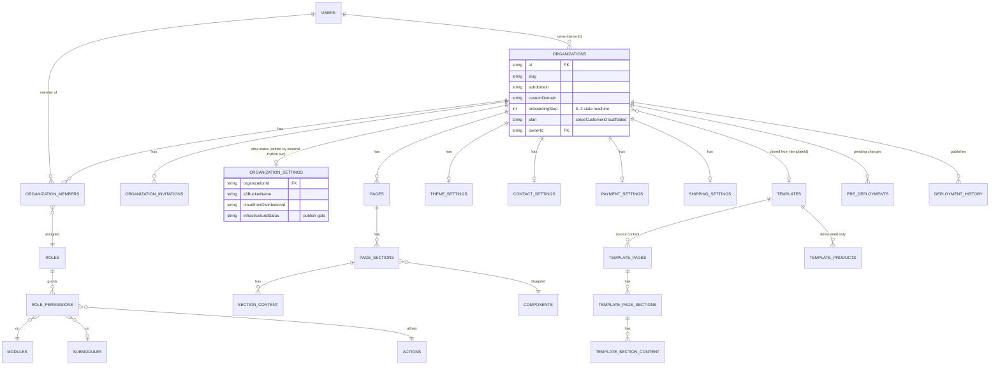
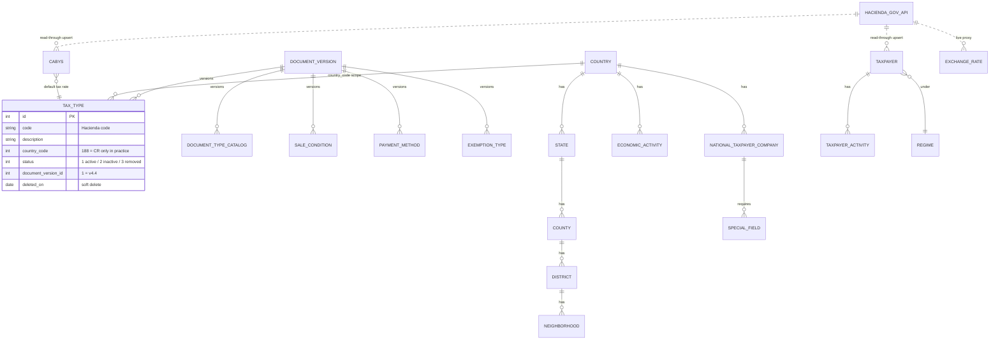
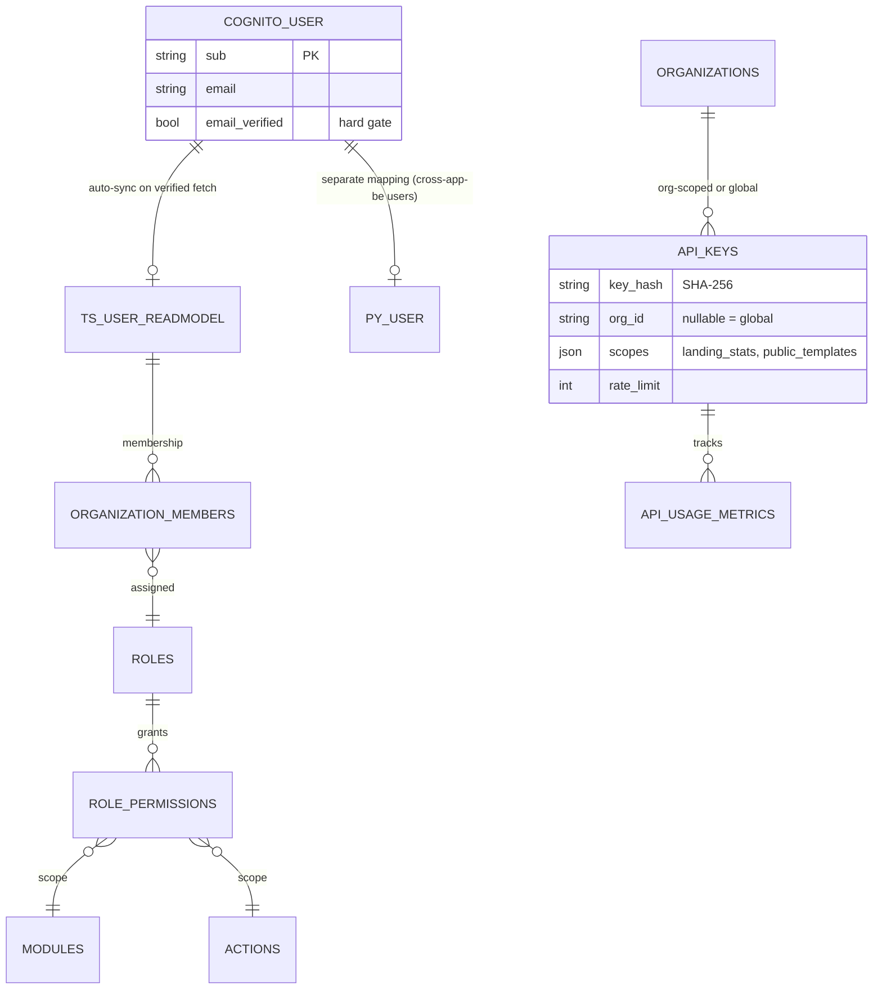

```mermaid
erDiagram
    %% cross-app-be owned (shared DB)
    ORGANIZATIONS ||--o{ BRANCHES : has
    BRANCHES ||--o{ TERMINALS : has
    ORGANIZATIONS ||--o{ PRODUCTS : has
    PRODUCTS }o--|| CATEGORIES : in
    PRODUCTS }o--o| CABYS : "fiscal code (data-services-owned table)"
    ORGANIZATIONS ||--o{ CLIENTS : has
    CLIENTS ||--o{ STORES : has
    CLIENTS ||--o{ DEPARTMENTS : has
    SALES_SESSIONS ||--o{ ASSIGNMENTS : has
    ASSIGNMENTS }o--|| BRANCHES : at
    ASSIGNMENTS }o--o| TERMINALS : on
    ASSIGNMENTS ||--o{ CLOSINGS : "closed by"
    ORGANIZATIONS ||--o{ POS_SALES : has
    POS_SALES }o--|| BRANCHES : at
    POS_SALES }o--|| TERMINALS : on
    POS_SALES }o--o| CLIENTS : "receiver"
    CROSSDOCKING_ORDERS }o--|| ORGANIZATIONS : for
    CROSSDOCKING_ORDERS ||--o{ CROSSDOCKING_ORDER_LINES : has
    CROSSDOCKING_ORDER_LINES }o--o| PRODUCTS : references
    CROSSDOCKING_ORDERS ||--o{ CROSSDOCKING_SALE_POINTS : "split to"
    CROSSDOCKING_SALE_POINTS ||--o{ CROSSDOCKING_ITEMS : has
    TERMINALS ||--o{ CONSECUTIVES : "per doc type"
    CONSECUTIVES }o--|| DOCUMENT_TYPES : for

    %% biller-apps/auth owned (same shared DB)
    ORGANIZATIONS ||--o| REGISTERED_ORGANIZATION : "Hacienda taxpayer profile"
    ORGANIZATIONS ||--o| ORGANIZATION_HACIENDA : "ATV creds + P12 cert"
    ORGANIZATIONS ||--o{ BILLING_SALES : "e-invoice documents"
    BILLING_SALES ||--o{ SALE_LINES : has
    SALE_LINES ||--o{ SALE_LINE_TAXES : has
    SALE_LINES ||--o{ SALE_LINE_DISCOUNTS : has
    SALE_LINES ||--o{ SALE_LINE_EXEMPTIONS : has
    BILLING_SALES ||--|| SALE_SUMMARY : "totals"
    BILLING_SALES ||--o{ SALE_PAYMENTS : has
    BILLING_SALES ||--o{ SALE_REFERENCES : "NC/ND refs"
    BILLING_SALES ||--o{ SALE_ATTACHMENTS : "XML/PDF artifacts"
    BILLING_SALES ||--o{ SALE_HACIENDA_ERRORS : "rejection detail"
    BILLING_SALES ||--o{ HACIENDA_DOCUMENT_LOG : "submit/poll audit"
    BILLING_SALES ||--o{ NOTIFICATIONS : "email/webhook outcomes"
    ORGANIZATIONS ||--o{ API_KEYS : "scoped (nullable = global)"
    ORGANIZATIONS ||--o{ ORGANIZATION_MEDIA : "media library (WIP)"

    BILLING_SALES {
        uuid sale_id PK
        string organization_id "scope key, no FK"
        string clave "50 digits"
        string consecutive_number "20 digits"
        int document_status
        int atv_validation_status "0..3 AtvStatus"
        int receiver_validation_status
    }
    POS_SALES {
        uuid sale_id PK
        string organization_id
        int document_type
        string activity_code
        json payments
        string receiver_fields "flattened"
    }
```

# Tsuru Ecosystem — Phase 3: Consolidated Domain Model

Audit deliverable. Sources: code in `E:/dev/BeautyMarket` (TS control-plane server + frontends), `E:/dev/cross-app-be` (Python POS backend), `E:/dev/biller-apps/auth` (Python e-invoicing core, misnamed "auth"), `E:/dev/biller-apps/data-services` (fiscal catalog platform), `landing-client` (static landing DXP). All claims cite concrete files; status markers used: **implemented**, **partial**, **scaffolded/dead**, **deprecated**.

---

## 0. System & Database Topology (context for ownership)

| System | Language/DB access | Primary persistence | Public endpoint |
|---|---|---|---|
| BeautyMarket/server (J-Markets control plane) | TS, Drizzle ORM (`server/src/config/database.ts`) | PostgreSQL (own connection, `NEW_DATABASE_URL`/SSM) | `markets-api.jcampos.dev` |
| cross-app-be (POS backend) | Python, SQLAlchemy 2.0 | **Shared** PostgreSQL (with biller-apps) | (POS data API) |
| biller-apps/auth (e-invoicing core, multi-Lambda) | Python, SQLAlchemy 2.0 + central Alembic | **Same shared** PostgreSQL as cross-app-be (`biller-apps/auth/alembic/env.py` excludes cross-app-be-owned tables) | `sales-api.jcampos.dev` |
| biller-apps/data-services (fiscal catalogs) | Python, SQLAlchemy 2.0 | **Same shared** PostgreSQL (cross-app-be reads its `cabys` table directly — `cross-app-be/app/services/cabys_service.py` lines 3–6) | `data-api.jcampos.dev` |
| landing-client (tsuru-landing) | TS/React, no DB | **Git is the database** — bundled JSON in `src/content/*.json`, published via `plugins/local-cms.ts` git commit+push | GitHub Pages `tsuru.jcampos.dev` |

Key topology fact: cross-app-be, biller-apps/auth, and data-services share **one Postgres database**; table ownership is enforced only by convention (Alembic `include_object` filters + code comments), not by schema/permissions. The BeautyMarket Drizzle DB is configured independently; whether it is the same physical Postgres is **unverified** — but the `organizations` table shape is replicated across both stacks (see §6).

---

## 1. E-commerce / Organization Domain (BeautyMarket TS server)

**Owner:** `BeautyMarket/server` (single Lambda, Express + Drizzle). This is a **tenant + CMS control plane, not a commerce engine**: there are no Product/Order/Customer entities, repositories, or routes (`server/src/entities/index.ts`, `server/src/routes.ts`) despite CLAUDE.md claims. Commerce nouns exist only as `templateProducts`/`templateCategories` demo seed data.

### Entities & ownership

| Entity (table) | Key attributes | Owner / status |
|---|---|---|
| `organizations` | id, name, slug, subdomain, customDomain, **onboardingStep (0–3)**, plan, ownerId, billingEmail, stripeCustomerId, templateId, legacy `settings` JSONB (marked for removal, `Organization.ts:15`) | TS server — source of truth for tenant identity. **Implemented** |
| `organization_settings` | s3BucketName, cloudfrontDistributionId, route53RecordId, acmCertificateArn, **infrastructureStatus** | **External Python infrastructure microservice writes it; TS server is read-only by contract** ("Do NOT add insert/upsert" — `server/src/entities/OrganizationSettings.ts`) |
| `users` | id (= Cognito sub), email, verification state | Cognito is auth truth; DB row is a synced read-model auto-created on first verified profile fetch (`server/src/services/UserService.ts`) |
| `organizationMembers`, `organizationInvitations` | userId, orgId, roleId; invitation token | TS server. **Implemented** |
| RBAC: `modules`, `submodules`, `actions`, `roles`, `rolePermissions` | Role → RolePermission → Module/Submodule/Action; system roles platform_admin/owner/admin | TS server (`server/src/seeds/rbac-seed.ts`). Model implemented; **enforcement NOT wired** (see §5) |
| CMS: `pages` → `pageSections` → `sectionContent`; global `components` blueprints | organizationId on every row; slug per page | TS server. **Implemented** |
| Settings: `themeSettings`, `contactSettings`, `paymentSettings`, `shippingSettings` | 1:1 per org; `paymentSettings.stripeEnabled` exists but **no Stripe SDK or payment code anywhere** | TS server. Settings implemented; payments **scaffolded only** |
| `templates` + `templateThemeSettings/ContactSettings/PaymentSettings/ShippingSettings/Pages/PageSections/SectionContent/Categories/Products` | name, displayName, category, thumbnailUrl, isActive, sortOrder; repo URLs in seed | TS server (gallery source content, cloned into orgs). **Implemented** |
| `preDeployments`, `deploymentHistory` | pending-changes accumulator → publish record | TS server. Publish writes `config.json` to per-org S3 bucket and immediately marks success — **no real build invocation** (`server/src/services/DeploymentService.ts`) |
| `categories`, `homePageContent` | — | **Legacy/dead**: no controller/routes; superseded by Page/Section CMS (`server/src/repositories/HomePageContentRepository.ts` orphaned) |

### ER diagram

---

## 2. POS / E-invoicing Domain (cross-app-be + biller-apps/auth)

Two Python codebases on **one shared Postgres**. Ownership split is documented in code: cross-app-be owns `organizations`, `branches`, `terminals` (read-only mirrors declared in biller-apps — `biller-apps/auth/shared/jbiller_common/hacienda/repositories/branch_repository.py` docstring, `alembic/env.py` exclusion filter); biller-apps/auth owns `billing_sales*`, `registered_organizations`, `organization_settings`/`organization_hacienda`, audit tables, `api_keys`, `organization_media`.

### Entities & ownership — cross-app-be (POS operational data)

Verified from `E:/dev/cross-app-be/app/models/*`:

| Entity (table) | Key attributes | Notes |
|---|---|---|
| `Organization` (`organizations`) | id, name, slug, subdomain, custom_domain, billing_email, plan, owner_id, **gln, internal_code, logo_url** | Same shape as BeautyMarket org + POS-specific extensions (`organization.py:18-34`) — competing definition, see §6 |
| `Branch` (`branches`) | organization_id, name, **code (int, feeds consecutive)**, type, CR geo FKs (state_id/county_id/district_id/neighborhood_id — values from data-services locations), created_by | `branch.py` |
| `Terminal` (`terminals`) | organization_id, branch_id FK, **code (int)**, device_id, registered_at, last_seen_at | `terminal.py` |
| `Product` (`products`) | organization_id FK→organizations, category_id FK, price, stock_quantity, track_inventory, is_service, **cabys_id FK→cabys (data-services-owned table)**, unit_measure, taxes/discounts/codes JSONB, exemption fields (authorization code, exempted_rate), factory_tax_charge_id | `product.py:24-79` — the *real* product entity of the ecosystem (the TS server has none) |
| `Sale` (`sales`) | organization_id, branch_id/terminal_id FKs (RESTRICT), branch_code/terminal_code, client_id, document_type (int, default 1), version_id, activity_code, sale_condition_id, credit_term, **flattened receiver_*** fields, payments JSON, subtotal/discount_amount totals | `sale.py:14-59` — POS sale record; overlaps biller `billing_sales` (§6) |
| `Client` (`clients`) → `Store` (`stores`), `Department` (`departments`) | stores/departments FK→clients | Customers feature (`client.py`, `store.py`, `department.py`) |
| `Session` (`sales_sessions`) → `Assignment` (`assignments`) → `Closing` (`closings`); `SessionProduct` | session→branch; assignment→session+branch+terminal; closing→session+assignment+branch+terminal | Cash-session lifecycle (`session.py`, `assignment.py`, `closing.py`) |
| Crossdocking: `Order` (`crossdocking_orders`) → `OrderLine`, `CrossDockingSalePoint` → `CrossDockingItem`, `Confirmation` (`crossdocking_confirmations`) | order FK→organizations, clients, stores, departments; lines FK→products | Distribution/crossdocking sub-domain (`order.py:14-57`) |
| `Consecutive` (`consecutives`) | terminal_id FK, document_type_id FK→document_types, counter; unique constraint | Local consecutive table (`consecutive.py`); biller-apps also increments consecutives atomically (`consecutive_repository.py`) |
| `DocumentType` (`document_types`), `Category`, `User`, `Cabys` (read-only mapping) | — | `document_type.py`, `cabys.py` (ownership note: data-services writes) |

### Entities & ownership — biller-apps/auth (e-invoicing documents)

| Entity (table) | Key attributes | Notes |
|---|---|---|
| `Sale` (`billing_sales`) + 13 children (`sale_lines`, `sale_line_taxes/discounts/exemptions`, `sale_payments`, `sale_references`, `sale_other_charges`, `sale_summary` 1:1, `sale_tax_summary`, `sale_attachments`, `sale_user_attachments`, `sale_hacienda_errors`) | organization_id (no FK), branch_id/terminal_id referencing cross-app-be tables, **clave (50-digit)**, consecutive_number, document_status, **atv_validation_status**, receiver_validation_status/consecutive, payment_status, status (default 1) | `shared/jbiller_common/models/sale.py:86-215`; migration `c3d4e5f6g7h8_create_sales_tables.py`. **Implemented end-to-end** |
| `RegisteredOrganization` (`registered_organizations`) | PK = organization_id; identification, regime, economic activities JSONB | Hacienda taxpayer profile; written by registered-organizations lambda, read by organization-configurations **via shared DB, not HTTP** (`registered_organization.py` docstring) |
| `OrganizationConfiguration` (`organization_settings` + `organization_hacienda`) | ATV username/password, **encrypted P12 certificate + pin**, notification settings (callbackUrl) | 1:1 per org (`app/organization-configurations/src/models/organization_configuration.py`, `encryption_utils.py`). Security smell: GET returns credentials + cert pin in response (`api-gateway/endpoints.json`) |
| `HaciendaDocumentLog`, `Notification` | keyed by clave/sale; submit + poll audit rows; per-email/callback outcome rows | `models/hacienda_document_log.py`, `models/notification.py` |
| `ApiKey` + `ApiUsageMetric` | SHA-256 key hash, org_id nullable (global keys), scopes, rate_limit | `app/lambda-authorizer/src/models/api_key.py` |
| `OrganizationMedia` (`organization_media`) | org-scoped media library, presigned uploads | **WIP** (head commit) |
| `Template` / `OrganizationTemplate` | repository_url for deploy | `app/infrastructure-service-provider/src/models/template.py` — **competing definition** with BeautyMarket `Template.ts` (§6) |

### ER diagram

---

## 3. Fiscal Catalogs Domain (biller-apps/data-services)

**Owner:** data-services (~30 CRUD micro-Lambdas + 4 `consumer-*` Hacienda-proxy Lambdas) at `data-api.jcampos.dev`. **No tenancy** — zero `organization_id` columns; scope keys are `country_code` (numeric ISO, 188 = CR) and `document_version_id` (Hacienda spec version, 1 = v4.4). Canonical shape from the 4-level base-model hierarchy `SimpleBase→GlobalCatalog→Catalog→CodedCatalog→Hacienda` in `shared/jmarkets_common/models/hacienda_base_model.py`: `id, code, description, country_code, status (1/2/3), deleted_on, document_version_id`.

| Entity group | Tables/services | Owner / notes |
|---|---|---|
| Tax catalogs | `tax_types` (`app/taxes/src/models/tax.py`), tax-rates, tax-amounts, tax-factors, tax-rate-codes, tax-conditions, factory-tax-charges | data-services authoritative |
| Document metadata | document types ("documents" service), document-versions (v4.4 = id 1), codes, reference-codes, references, transaction-types, notification-codes | data-services; "documents"/"transactions" are **misnomers** (type catalogs, not data) |
| Commerce conditions | sale-conditions, discount-types, payment methods ("payments"), other-charges, measurement-units, customer-types, product-types, pharmaceutical-forms | data-services |
| Exemptions | exemptions, exemptions-issuing-institutions; live validation via consumer-exemptions (`hacienda_api_client.get_exemption()`) | data-services + Hacienda gov API upstream |
| `Cabys` (`cabys`) | consumer-cabys: search-and-upsert from api.hacienda.go.cr + 20k-row Excel bulk import (`app/consumer-cabys/src/services/hacienda_cabys_service.py`) | **data-services is the writer; cross-app-be is read-only via `Product.cabys_id` FK** — cross-repo contract documented only in a comment (`cross-app-be/app/services/cabys_service.py:3-6`) |
| Taxpayer registry | `Taxpayer` + `TaxpayerActivity` (consumer-identifications, fetch→upsert cache of Hacienda registry), `NationalTaxpayerCompany` + special fields | data-services caches; Hacienda gov API is truth |
| Geography & currency | countries/states/counties/districts/neighborhoods, currencies, economic-activities, regimes, identification types; exchange rates (consumer-exchange-rate) | data-services; CR geo IDs consumed by cross-app-be `Branch.state_id…` and `Sale.receiver_state_id…` as **FK-less integers** |

Consumption pattern: the POS frontend consumes catalogs **over HTTPS per keystroke** (`templates/pos-system/src/services/data-api/client.ts`); cross-app-be deliberately **avoids HTTP and reads the same Postgres directly**, receiving catalog descriptions from the FE (`templates/pos-system/src/types/receiver.ts` comment: "the sales-api Lambda has no access to the data-api catalog").

---

## 4. Identity & Access Domain

**Source of truth: AWS Cognito** (pool `us-east-1_A74zp2qOE` hardcoded in both `biller-apps/auth/api-gateway/template.yml` and `data-services/api-gateway/template.yml`; the BeautyMarket stack has its own Cognito CFN stack).

| Entity | Owner | Status |
|---|---|---|
| Cognito user (sub, email, email_verified) | Cognito | Implemented; custom-message email Lambda trigger in `BeautyMarket/server/lambda.cts` (`cognitoHandler`) |
| `users` read-model (TS) | BeautyMarket server — auto-synced on verified profile fetch (`UserService.ts`) | Implemented |
| `users` (Python, cross-app-be `user.py`) | cross-app-be — separate user mapping in shared DB | Competing definition (see §6) |
| RBAC graph (roles/modules/submodules/actions/rolePermissions) | BeautyMarket server | Model + seeds + middleware implemented, **middleware wired into zero routes** (`server/src/middleware/permissions.ts`, grep-confirmed) |
| `ApiKey`/`ApiUsageMetric` | biller-apps/auth lambda-authorizer | Implemented but **dormant**: deployed gateway uses plain Cognito authorizer; tri-mode authorizer not wired (`api-gateway/template.yml`) |
| Org membership check (Python) | biller-apps/auth `lambda-authorizer/src/validators/organization_auth_checker.py` | **Stub**: "TODO: Implement actual user-organization membership check", role hardcoded `"member"` |

Effective authorization reality across the ecosystem (all **partial**):
- BeautyMarket: API Gateway validates JWT only; **no userId-vs-sub path check found** in `api-gateway/template.yml` despite docs claiming it; Postgres RLS policies are permissive `using true` (e.g. `server/src/entities/Organization.ts`) — no real isolation beyond WHERE clauses.
- biller-apps/auth: controllers trust an unverified `x-user-id` header (`sale_controller.py`: `user_id = x_user_id or "anonymous"`).
- data-services: Cognito authn only, no authz; any authenticated user can call exposed mutation endpoints.
- landing-client: no runtime auth at all; admin CMS protected only by the compile-time tree-shake gate `src/lib/admin-enabled.ts` + localhost-only dev middleware (`plugins/local-cms.ts:165-167`).

---

## 5. Business Rules & Lifecycles (discovered in code)

### 5.1 Organization onboarding state machine (BeautyMarket)
`organizations.onboarding_step`: `0 = not started, 1 = basic info, 2 = contact info, 3 = completed` (comment in `server/src/entities/Organization.ts:22`). Transitions: create → step 1 (`OrganizationService.ts:72`); step2 endpoint → 2 (`:197`); step3 sets `templateId` + step 3 (`:212`) and triggers `TemplateCloneService.cloneTemplateToExistingOrg()` (clones theme/contact/payment/shipping settings + pages→sections→content + optional categories). Dashboard does not auto-redirect into incomplete orgs (< 3 shows "continue setup").

### 5.2 Email-verification gate (BeautyMarket)
Login → backend checks Cognito `email_verified` on **every** profile fetch; unverified → 403 `needsVerification: true` + forced logout; verified-but-missing → auto-create DB user from Cognito (`server/src/services/UserService.ts`). Cognito is single source of truth.

### 5.3 Publish/deploy gating (BeautyMarket)
Publishing is blocked unless `organization_settings.infrastructureStatus === 'active'` (`DeploymentService.ts`); infra status is written asynchronously by the external Python infrastructure microservice reacting to the SNS `OrganizationRegisteredEvent` (`services/OrganizationEventPublisher.ts`, `cloudformation/organization-publish-topic.yml`). Pre-deployments accumulate pending changes until publish.

### 5.4 E-invoice document numbering invariants (biller-apps/auth)
- **Consecutive = exactly 20 digits**: `3-digit branch code + 5-digit terminal code + 2-digit document type + 10-digit sequence` (`shared/jbiller_common/hacienda/repositories/consecutive_repository.py:4,120`); allocation is atomic.
- **Clave = exactly 50 chars**: `country(3) + day(2) + month(2) + year(2) + issuer_id(12) + consecutive(20) + situation(1) + security(8)`; `ValueError` if consecutive isn't 20 digits or result isn't 50 (`hacienda/services/clave_service.py`).
- **Atomicity rule**: the entire Hacienda submission runs in one DB transaction so a failure rolls back both the sale and the consecutive increment (`app/sales-api/src/services/sales_pipeline.py` header, 16-step orchestration).

### 5.5 Document validation state machine (biller-apps/auth)
- **AtvStatus** (Hacienda reception verdict): `0 PROCESSING ("En proceso") → 1 ACCEPTED / 2 PARTIAL ("Aceptado parcialmente") / 3 REJECTED` (`shared/jbiller_common/hacienda/enums/atv_status.py`). Stored on `billing_sales.atv_validation_status`; rejection details land in `sale_hacienda_errors`.
- **Document types**: Hacienda codes `FE=01, ND=02, NC=03, TE=04, CCE=05, CPCE=06, RCE=07, FEC=08, FEE=09, REP=10` (`hacienda/enums/document_type.py`), plus flow direction `EMISION=1 / RECEPCION=2` (`enums/document_types.py`).
- **Receiver verdicts**: accept / partial / reject endpoints (`.../invoice-validation`) write `receiver_validation_status` + `receiver_validation_consecutive`.
- **Async pipeline contract**: sales-api → validation FIFO → document-validator → pdf FIFO → document-pdf-generator → notification FIFO → document-notification; the validator **never** notifies directly — the PDF lambda always fires `SEND_NOTIFICATION` (`cloudformation/hacienda-messaging.yml` + pipeline docstrings).
- **NotificationStatus**: `PENDING → SENT | FAILED`, webhook `CALLBACK_OK | CALLBACK_ERROR` (`hacienda/enums/notification_status.py`).

### 5.6 Catalog lifecycle (data-services)
Universal `StatusCodes` enum `1 ACTIVE / 2 INACTIVE / 3 REMOVED` + `deleted_on` soft delete (`shared/jmarkets_common/models/hacienda_base_model.py`; same enum replicated in `jbiller_common/enums/status_codes.py`). PATCH = status change; DELETE = soft delete. Every catalog is versioned by `document_version_id` (Hacienda spec axis) and scoped by `country_code` — multi-country design, **single-country (CR=188) reality** (consumer-identifications hardcodes the CR fallback). `consumer-*` services are read-through caches: every search/lookup **upserts** into local Postgres.

### 5.7 POS session/cash lifecycle (cross-app-be) — verified in source
- `sales_sessions → assignments (session+branch+terminal) → closings (session+assignment+branch+terminal)` with CASCADE deletes session→assignment→closing (`app/models/{session,assignment,closing}.py`); `SessionProduct` pins products to a session (unique constraint).
- Session shape: `type ∈ {'match','shift'}`, `context ∈ {'gradas','mesa','caja'}`, `status` int `1=Active 2=Inactive 3=Deleted`, expected vs actual revenue (`app/models/session.py:30-44`) — the same 1/2/3 status convention as the data-services catalogs; the match/gradas vocabulary is a stadium-concession origin fossil.
- One active assignment per user enforced by a **unique partial index** on `assignments` (`app/models/assignment.py`).
- Cash reconciliation: `closings` stores expected vs declared cash/SINPE/card; the differences are **Postgres `Computed` columns** `(declared_x - expected_x)` (`app/models/closing.py:79-96`) — the DB, not the app, computes shortages.
- Manager-only approve/reject of closings exists but the `is_manager` parameter **defaults to `True`** "for backward compatibility" (`app/services/closing_service.py`, `docs/CLOSING_AUTHORIZATION.md`) — the only in-app role gate in cross-app-be is effectively open. **Partial enforcement.**

### 5.8 Cross-docking order lifecycle (cross-app-be) — verified in source
- Pipeline: retailer PO Excel parse (`app/services/excel_parser.py`, Spanish headers NUM_DOC/NOMBRE_CLIENTE/UXC) → `crossdocking_orders` with `order_status` default `"pending"` (`app/models/order.py:23`) → distribution Excel parse → sale points/items → PDF+Excel reports to S3/CloudFront → `crossdocking_confirmations` grouping → SES email.
- Invariants: unique `(company_id, document_number)` per order (`order.py:78`); unique `(company_id, client_gln, nationality)` per client (`app/models/client.py`).
- Debt rules: `creation_date`/`delivery_date` stored as `String(20)` not timestamps (`order.py:22`); confirmation emails go to a **single static `EMAIL_RECIPIENT`**, not per-client; "Modas Laura" branding hardcoded in email HTML (`app/services/email_service.py`) — single-tenant logic inside a multi-tenant service.
- Cross-domain side effect: order ingest **auto-creates Organization rows** with `owner_id='system'` (`_sync_organization` in `app/services/order_service.py`) — a write into the identity domain triggered by an Excel upload.

### 5.9 Landing content lifecycle (landing-client)
Content edit → JSON write via dev middleware (`POST /__local/content`) → publish = `git add src/content src/translations public && git commit && git push` (`plugins/local-cms.ts`) → GitHub Pages workflow rebuild. Git history **is** the version store. Validation rules: localhost-only Host header, filename whitelists, 25 MB asset cap, path-traversal guard; CI greps the bundle for `__local` leakage (`.github/workflows/deploy.yml`).

---

## 6. Cross-Domain Links, Duplications & Competing Definitions

### 6.1 `Organization` — defined in at least 4 codebases
| Codebase | Definition | Claimed role |
|---|---|---|
| BeautyMarket TS | `server/src/entities/Organization.ts` (Drizzle; onboardingStep, plan, stripeCustomerId, templateId) | Source of truth for tenant identity |
| cross-app-be | `app/models/organization.py` (same core columns + `gln`, `internal_code`, `logo_url`) | **Declared owner of `organizations` in the shared Python DB** per `biller-apps/auth/alembic/env.py` exclusion |
| biller-apps/auth | read-only mirror w/ slug/subdomain/stripe_customer_id (`branch_repository.py` docstring: "cross-app-be owns it") | Reader |
| biller-apps/auth infrastructure-service-provider | own Organization/Template models for storefront provisioning | Reader/deployer |

Conflict: TS server and cross-app-be both behave as writers of an `organizations` table; if these are two physical DBs, the org record is dual-mastered with no sync mechanism found; if one DB, two ORMs with diverging columns write the same table. Verified writer evidence on the Python side: cross-app-be's own docstring says "Maps to the **existing BeautyMarket** organizations table … new columns (gln, internal_code, logo_url) are added by our migration" (`app/models/organization.py:12-17`) — i.e. cross-app-be both **mutates the schema** of the shared table and **inserts rows** (`_sync_organization`, `owner_id='system'`). Combined with markets-api's Drizzle writes (`server/src/entities/Organization.ts` + `OrganizationService.ts`), the org record has at least two active writers. **Unresolved — flag for Phase 4.**

### 6.1b `Consecutive` — dual write paths on invoice numbering
cross-app-be exposes full CRUD on a `consecutives` table keyed `(terminal, document_type)` (`app/models/consecutive.py`, `app/controllers/consecutives_controller.py`) while biller-apps/auth **allocates from `consecutives` atomically** inside the sales pipeline (`shared/jbiller_common/models/consecutive.py`, `consecutive_repository.py`). Two codebases, two ORMs, one fiscal-numbering counter: invoice-number integrity (Hacienda requires gapless, unique 20-digit consecutives) depends on both agreeing on locking semantics. Highest-stakes shared-table coupling in the ecosystem.

### 6.2 `Sale` — two competing sale entities in the same shared DB
- cross-app-be `sales` (`app/models/sale.py`): POS sale with flattened receiver, payments JSON, totals.
- biller-apps/auth `billing_sales` + 13 child tables (`jbiller_common/models/sale.py`): the Hacienda document of record (clave, ATV status, attachments).
Both model "a sale with a receiver and payments"; the POS FE talks to `sales-api.jcampos.dev` (billing_sales) while cross-app-be keeps its own table. Overlap/ownership of "the sale" is the largest entity-duplication risk in the ecosystem.

### 6.3 `Template` — three definitions
BeautyMarket `server/src/entities/Template.ts` (gallery + clone source, seeded with GitHub repo URLs), biller-apps `infrastructure-service-provider/src/models/template.py` (repository_url for deployment), and the landing site as a read-only consumer of `GET /api/templates?activeOnly=true` that **derives preview URLs by convention** client-side (`landing-client/src/pages/Examples.tsx:117`, `https://{name}-example.j-markets.jcampos.dev`).

### 6.4 Infrastructure provisioning — duplicated three ways
(1) BeautyMarket Node script `deploys/setup-template-bucket.js` (S3+CloudFront+Route53+ACM), (2) BeautyMarket TS `aws-daos/{CloudFrontDao,Route53Dao,AcmDao}.ts` (**largely superseded/dead**), (3) biller-apps `infrastructure-service-provider` Python lambdas (the active SNS-driven consumer that writes `organization_settings`). The TS server's read-only contract on `organization_settings` is the strangler-fig boundary (`entities/OrganizationSettings.ts`).

### 6.5 Shared-DB couplings without API contracts
- cross-app-be → data-services `cabys` table: FK `products.cabys_id`, contract documented only in a comment (`cross-app-be/app/services/cabys_service.py:3-6`).
- biller-apps/auth → cross-app-be `organizations/branches/terminals`: read-only mirrors, convention enforced only in `alembic/env.py`.
- registered-organizations ↔ organization-configurations lambdas: shared-DB repository imports, "no inter-Lambda HTTP hop" (`registered_organization.py` docstring) — microservice boundaries are logical, not physical.
- CR geography IDs (state/county/district/neighborhood) flow from data-services into cross-app-be `branches` and `sales` receiver fields as plain integers, no FK.

### 6.6 Commerce gap
BeautyMarket docs claim product/order/customer management; **no such entities or routes exist** there. Real products live in cross-app-be (`app/models/product.py`); real sales in cross-app-be/biller-apps; storefront templates render CMS content + `config.json`, not live commerce. Stripe/PayPal are **scaffolded only** everywhere (env keys + `stripeCustomerId` columns, zero SDK/payment code).

### 6.7 Dead/legacy entity inventory (for cleanup tracking)
- BeautyMarket: `homePageContent` + repository (no controller), `Category.ts` legacy constants, permissions middleware unused, `lambda.cts` SQS branch stubs, no-op RLS on 23 tables.
- biller-apps/auth: `app/hacienda-history` legacy lambda overlapping document-validator's `VALIDATE_HISTORY_DOCUMENT`; lambda-authorizer dormant; doc-vs-code drift ("stub" docstrings over an implemented pipeline).
- data-services: no-op cache decorators with live CacheController invalidation endpoints (`shared/jmarkets_common/utils/cache_utils.py` TODO); `biller-apps/loctions` (sic) legacy duplicate of locations.
- landing-client: ~290-line dead `useAuth.ts`, `useOrganization.ts`, `auth-navbar.tsx`, multi-tenant `apiUtils.ts` builders — drag aws-amplify into the bundle with no routed auth flow.
