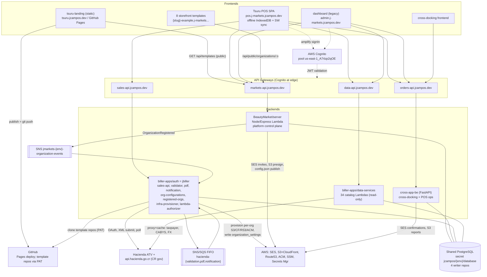

# Tsuru Ecosystem — System Discovery (Audit Phase 2 + 2.5)

> Multidisciplinary audit deliverable: applications inventory, real domain ownership, data ownership,
> API surface & communication patterns, integration map, misnomers & surprises.
> Names are NOT trusted; responsibilities derive from code. Every significant claim cites file paths.
> Date: 2026-06-11. Status labels: **implemented**, **partial**, **scaffolded/dead**, **deprecated**.

---

## 1. Applications & Services Inventory (name vs. REAL purpose)

| # | Repo / Location | Name says | REALLY is | Status |
|---|---|---|---|---|
| 1 | `BeautyMarket/server` (deployed `markets-api.jcampos.dev`) | "BeautyMarket" e-commerce backend | **JMarkets platform control plane only**: Cognito user sync, organization lifecycle + 3-step onboarding, memberships/invitations, RBAC *metadata*, storefront CMS (pages→sections→content), template gallery + cloning, per-org settings, S3 presign, publish/deploy pipeline. **Zero product/order/customer endpoints** — those moved to Python services. Evidence: `server/src/routes.ts`, `server/src/services/{OrganizationService,TemplateCloneService,DeploymentService}.ts`; no Product/Order controller in `server/src/controllers/`. | Production, mid-refactor; last meaningful change ~2026-04 |
| 2 | `landing-client` → repo `chepelcr/tsuru-landing` (deployed `tsuru.jcampos.dev`, GitHub Pages) | Marketing landing page | **100%-static bilingual marketing SPA + dev-only git-backed CMS ("landing DXP")**: all copy in `src/content/*.json` (22 files); admin (`src/admin/`, 26 pages) edits JSON via Vite dev middleware (`plugins/local-cms.ts`); "publish" = `git add/commit/push` triggering the Pages deploy. Only runtime API call: public `GET /api/templates` (`src/pages/Examples.tsx:106-110`). | Production; well-engineered; zero tests |
| 3 | `templates/pos-system` → repo `chepelcr/tsuru-pos-system` (deployed `pos.j-markets.jcampos.dev`) | A storefront "template" | **Tsuru POS — full standalone product**: multi-tenant POS workstation + admin dashboard for Costa Rica Hacienda v4.4 e-invoicing. Frontend-only thick client over **four** API gateways (markets-api, orders-api, sales-api, data-api), offline-first sale capture (Dexie IndexedDB + service-worker background sync, `src/lib/db.ts`, `public/sw.js`), client-side tax/discount engines mirroring the backend (`src/services/taxCalculationService.ts`, `CALCULATION_AUDIT.md`). Also absorbed the old dashboard's org-management/CMS/templates/deployments pages. | Production, actively developed |
| 4 | `cross-app-be` (deployed as **"cd-backend"** at `orders-api.jcampos.dev`) | "Cross-app backend" / titled "Cross-Docking API" | **TWO unrelated systems in one FastAPI Lambda**: (a) cross-docking order distribution for a wholesale apparel supplier (**"Modas Laura"** hardcoded) — PO Excel ingest `app/services/excel_parser.py`, PDF/Excel reports `app/services/pdf_service.py`, SES delivery confirmations `app/services/email_service.py`; (b) POS/event-sales backend — sessions `match/shift` with contexts `gradas/mesa/caja` (`app/models/session.py`), branches/terminals, cashier assignments, cash closings, sales with Hacienda metadata, per-terminal consecutives, live dashboard. Plus product/category CRUD on the **shared** BeautyMarket products table (`app/controllers/products_controller.py`). | Production, mature (35 alembic migrations, real test suite) |
| 5 | `biller-apps/auth` (deployed `sales-api.jcampos.dev` + `jmarkets-{env}-lambda-authorizer`) | Authentication service | **The Costa Rica e-invoicing CORE ("jbiller")**: multi-Lambda Python backend — sales document creation, XAdES-EPES XML signing, ATV (Hacienda) submission, validation polling, PDF generation, email/webhook notification (`app/sales-api/src/services/sales_pipeline.py`, `shared/jbiller_common/hacienda/services/`). Only one component is auth-related: the multi-mode lambda-authorizer (`app/lambda-authorizer/`). Also hosts org Hacienda credentials/certificate config, registered-organization taxpayer profiles, media library, Hacienda OAuth token brokerage, and a per-org **infrastructure provisioner** (S3/CloudFront/Route53/ACM + git template deploy, `app/infrastructure-service-provider/`). | Production, young & active (git history Mar–Jun 2026) |
| 6 | `biller-apps/data-services` (deployed `data-api.jcampos.dev`, stack `jcampos-{env}-hacienda-data-api`, internally "CommonData") | Generic data services | **Read-mostly Hacienda v4.4 fiscal reference-data platform**: 34 FastAPI-on-Lambda microservices serving tax catalogs, CR geography hierarchy, CABYS, document versions, and live proxy/cache of Hacienda's public API (taxpayer lookup, exemptions, exchange rates). No tenant data anywhere — no organization_id/user_id in any model. Evidence: `shared/jmarkets_common/models/hacienda_base_model.py`, `api-gateway/endpoints.md` (~73 GET endpoints). | Production; GET-only at the gateway; caching scaffolded-dead |
| 7 | `BeautyMarket/dashboard` (`admin.j-markets.jcampos.dev`) | Admin dashboard | Legacy React admin app; its org/CMS/members/deployments features were **re-implemented inside the POS app** (`pos-system/src/pages/dashboard/{Org*Page,ContentPage,TemplatesPage,DeploymentsPage,GalleryPage,MembersPage}.tsx`), leaving the dashboard duplicated. Old `client/` already formally deprecated (`client/DEPRECATED.md`). | Deprecating-in-place (de facto) |
| 8 | `BeautyMarket/templates/*` (8 storefronts: jmarkets-demo … beauty-essentials) | Store templates | The only things in `templates/` that ARE templates: customer-facing storefront SPAs at `{name}-example.j-markets.jcampos.dev`, rendering CMS content from markets-api public endpoints + per-org S3 `config.json`. | Production demo sites |
| 9 | "Python infrastructure microservice" (referenced by markets-api; lives in `biller-apps/auth/app/infrastructure-service-provider/`) | — | Consumes `OrganizationRegistered` SNS events, provisions per-org S3/CloudFront/Route53/ACM, **writes** `organization_settings` which the Node server maps read-only (`server/src/entities/OrganizationSettings.ts`: "Do NOT add insert/upsert"). | Production |

**Repo-split limbo**: `templates/pos-system/` and `landing-client/` are simultaneously tracked in the BeautyMarket monorepo AND are standalone git repos with their own CI (monorepo `CLAUDE.md` split rules; nested `.git` remotes confirmed). Landing has **two deploy paths for the same code**: monorepo `deploys/setup-template-bucket.js` → `j-markets.jcampos.dev` (S3/CloudFront) vs `.github/workflows/deploy.yml` → `tsuru.jcampos.dev` (GitHub Pages).

**Two product lines share one ecosystem**: (1) **J-Markets** storefront SaaS (server control plane + dashboard + 8 templates + landing) and (2) **Tsuru POS / CR e-invoicing** (pos-system + cross-app-be POS half + jbiller + data-services). They are fused by one Cognito pool, one Postgres database, shared `organizations`/`products` tables, and duplicated template/infra-provisioning domains.

---

## 2. Real Domain Ownership Map

| Business domain | REAL owner | Evidence | Notes |
|---|---|---|---|
| User identity & auth | **AWS Cognito** (pool `us-east-1_A74zp2qOE`); synced copy in markets-api `users` table | `server/src/services/UserService.ts` (auto-sync on profile fetch), Cognito authorizers in all four `api-gateway/template.yml` files | One pool shared by all four gateways and both frontends |
| Organizations (tenant root) | **markets-api** | `server/src/entities/Organization.ts` | Read-only in jbiller (`shared/jbiller_common/models/organization.py`); but **written** by cross-app-be (`_sync_organization` in `app/services/order_service.py` auto-creates orgs with `owner_id='system'`; added columns gln/internal_code/logo_url via its own alembic) — ownership leak |
| Memberships, invitations, RBAC metadata | markets-api | `server/src/services/{MembershipService,InvitationService,RBACService}.ts`, `seeds/rbac-seed.ts` | RBAC is **data, not enforcement** (see §4.5) |
| Storefront CMS, template gallery + cloning, per-org settings, publish pipeline | markets-api | `server/src/entities/{Page,PageSection,SectionContent,Template*}.ts`, `TemplateCloneService.ts`, `DeploymentService.ts` | Edited from the POS app UI (`pos-system/src/hooks/useCmsContent.ts`, `useDeployments.ts`) |
| Per-org AWS infrastructure (S3/CF/R53/ACM), custom domains, template git-deploy | **jbiller infrastructure-service-provider** | `auth/app/infrastructure-service-provider/src/services/{infrastructure_provisioning_service,custom_domain_service,template_deployment_service}.py` | Duplicates the monorepo's `deploys/setup-template-bucket.js` domain; also mirrors markets-api's `templates` table (`models/template.py` with repository_url) |
| Products & categories | **cross-app-be** (live CRUD + fiscal enrichment) on tables created by BeautyMarket — de facto co-owner | `cross-app-be/app/controllers/products_controller.py`, alembic `b1c2d3e4f5a6_add_cabys_and_product_fiscal_fields.py`; markets-api keeps only `template_products` samples | Two historical write paths, two validation stacks, one table |
| B2B clients / stores / departments (retailer master data, GLN) | cross-app-be (sole owner) | `app/models/{client,store,department}.py` | "Stores" = retailer delivery points, not e-commerce storefronts |
| Cross-docking orders, confirmations, distribution reports | cross-app-be (sole owner) | `app/models/order.py` (`crossdocking_orders`), `app/services/{order_service,confirmation_service,pdf_service}.py` | Excel is the integration medium; GLN/BGM EDI vocabulary but no real EDI feed |
| POS ops: sessions, assignments, branches, terminals, closings, consecutives, dashboard | cross-app-be (sole owner) | `app/models/{session,assignment,branch,terminal,closing,consecutive}.py`, `app/services/dashboard_service.py` | Sale capture here stores Hacienda metadata but does **not** sign/submit — emission is jbiller's job |
| Electronic invoice lifecycle (create → sign → submit → validate → PDF → notify) | **jbiller** | `app/sales-api/src/services/sales_pipeline.py`, `shared/jbiller_common/hacienda/services/{xml_build_service,xml_sign_service,hacienda_submission_service,clave_service}.py`, `app/document-validator/src/services/validator_pipeline.py` | Owns `billing_sales` + its OWN `consecutives` table — a second numbering system besides cross-app-be's |
| Hacienda credentials (ATV user/pass, P12 cert + PIN), taxpayer profile, media | jbiller (organization-configurations, registered-organizations lambdas) | `app/organization-configurations/src/models/organization_configuration.py` (`certificate: Mapped[bytes]`), `shared/jbiller_common/models/registered_organization.py` | Certs/passwords plaintext in Postgres — security debt |
| Fiscal reference catalogs (taxes, CABYS, geo, document versions, taxpayer lookup, FX) | **data-services** (Hacienda government API is the upstream authority) | `shared/jmarkets_common/models/hacienda_base_model.py`, `app/consumer-*/` | jbiller deliberately denormalizes codes to strings because it "does not have access to the cross-app-be data-api" (`sale.py` docstring) |
| Tax/discount calculation logic | **Triplicated**: POS browser engines, cross-app-be Python services, jbiller pipeline math | `pos-system/src/services/{taxCalculationService,discountCalculationService}.ts` (mirror cross-app-be per pos CLAUDE.md §8), `CALCULATION_AUDIT.md` | Business-critical dual/triple-maintenance, locked by a "don't bump versions" rule |
| API keys & usage metrics | jbiller lambda-authorizer | `app/lambda-authorizer/src/models/api_key.py` (SHA-256 hashed, scopes, rate limits) | The only component in `auth` that is actually auth |
| Marketing content, blog, SEO | tsuru-landing (git as the database) | `src/content/*.json`, `plugins/local-cms.ts`, `scripts/prerender.mjs` | Git history IS the content version store |

---

## 3. Data Ownership (source of truth per entity family)

All backends share **one PostgreSQL database** (secret `jcampos/{env}/database`); schema ownership is split across ≥4 repos, each with its own migration tool (Drizzle vs 3× Alembic). Cross-repo write contracts exist only as **docstrings**.

| Entity family (tables) | Source of truth | Writers | Readers | Evidence |
|---|---|---|---|---|
| `users` | Cognito (auth/verification); table = synced copy owned by markets-api | markets-api only ("Never write to this table from cross-app-be") | all backends by user_id string | `server/src/services/UserService.ts`; `cross-app-be/app/models/user.py` docstring |
| `organizations` | markets-api | markets-api; **also cross-app-be** (`_sync_organization`, own column migrations) | jbiller (read-only validation), data flows everywhere | `server/src/entities/Organization.ts`; `cross-app-be/app/models/organization.py`; `auth/.../organization_validations_repository.py` ("never write a record for a phantom org") |
| `organization_settings` (infra: bucket, CF dist id, cert ARN, infrastructureStatus) | jbiller infra provisioner (SQLAlchemy) | provisioner only | markets-api (Drizzle mirror with explicit do-not-write rule; gates `DeploymentService.publishPreDeployment`) | `server/src/entities/OrganizationSettings.ts` |
| `organization_members`, `organization_invitations`, RBAC tables | markets-api | markets-api | POS app via markets-api | `server/src/entities/`, `seeds/rbac-seed.ts` |
| CMS (`pages`, `page_sections`, `section_content`, `components`), `templates` + 9 `template_*` tables, `pre_deployments`, `deployment_history` | markets-api | markets-api | POS app, landing Examples page, storefronts (`PublicOrgController.ts`) | `server/src/entities/Template*.ts`, `PreDeployment.ts` |
| `products`, `categories` | shared/co-owned: created by BeautyMarket, fiscal columns + live CRUD by cross-app-be | cross-app-be (live); markets-api (template samples only) | POS, storefronts | `cross-app-be/app/models/product.py` |
| `clients/stores/departments`, `crossdocking_*` (orders, lines, sale_points, items, confirmations) | cross-app-be | cross-app-be | POS + cross-docking frontends | `cross-app-be/app/models/` |
| `sales_sessions/assignments/branches/terminals/closings/session_products`, cross-app `sales`+lines, cross-app `consecutives` | cross-app-be | cross-app-be | POS frontend | `app/models/{session,closing,consecutive}.py` (generated difference columns, partial unique indexes) |
| `billing_sales` + 9 children, jbiller `consecutives`, `hacienda_document_logs`, `notifications` | jbiller (sales-api writes; validator/pdf/notification lambdas update status/URLs) | jbiller lambdas | POS via sales-api | `shared/jbiller_common/models/{sale,consecutive,hacienda_document_log,notification}.py` |
| `registered_organizations`, `organization_hacienda`, media | jbiller | jbiller | POS via root-mounted authOrgPath endpoints | `auth/app/organization-configurations/src/models/organization_configuration.py` |
| `api_keys`, `api_usage_metrics` | jbiller lambda-authorizer | authorizer + `api-management/` tooling | gateway authorization | `app/lambda-authorizer/src/models/api_key.py` |
| Hacienda catalogs (`tax_types/tax_rates/...`, `cabys`, geo, `document_versions`, `taxpayers`, `exchange_rates`) | data-services Postgres mirror; **Hacienda is upstream authority** | seed scripts (`scripts/seed_catalogs.py`, localhost-only) + consumer-* upsert-on-read | POS via HTTP; **jbiller and cross-app-be read `cabys`/`document_types` tables directly via shared DB** | `cross-app-be/app/models/cabys.py` + `document_type.py` docstrings; `data-services/shared/jmarkets_common/models/hacienda_base_model.py` |
| Marketing content / blog / themes / SEO | tsuru-landing JSON in git | dev-only local-CMS middleware | static build + prerender | `src/content/*.json`, `plugins/local-cms.ts` |
| Offline sale queue | POS browser IndexedDB `pos-system-db` (local copy, synced to sales-api) | POS app + service worker | — | `pos-system/src/lib/db.ts`, `public/sw.js` |
| Stripe billing | **nobody** — schema fields only (`organizations.stripeCustomerId`, paymentSettings.stripeEnabled); no SDK in any repo | — | — | `server/src/entities/Organization.ts` |

---

## 4. API Surface & Communication Patterns

### 4.1 Four public API gateways (sync HTTP; Cognito-authorized at the edge)

| Gateway | Backend | Key path shapes |
|---|---|---|
| `markets-api.jcampos.dev` | BeautyMarket `server` (Express, single Lambda, serverless-http) | `/api/users/:u/organization/:o/...` (**singular** — settings/CMS/pre-deployments/uploads) vs `/api/users/:u/memberships/organization/:o/...` (members/invitations/rbac); `/api/users/:u/{profile,organizations,memberships}`; public `/api/templates`, `/api/public/organizations/:o/...`, `/api/organizations/{check-slug,by-subdomain}`, invitation token accept — `server/src/routes.ts:29-130` |
| `orders-api.jcampos.dev` | cross-app-be (FastAPI uni-Lambda) | `/api/organizations/{o}/{clients(+stores,departments),orders(+parse,reprocess,crossdocking/parse),confirmations,products(+parse,price-bounds),categories,branches(+terminals),sessions,assignments,sales,closings,consecutives,dashboard}` + one legacy `/api/users/{u}/organizations/{o}/assignments` — `app/configuration/fast_api_config.py`; gateway swagger hand-synced from `api-gateway/endpoints.json` (1,574 lines) |
| `sales-api.jcampos.dev` | jbiller (sales-api + organization-configurations + registered-organizations + infra lambdas behind one gateway) | `/api/organizations/{o}/sales[...]`, `/invoice-validation`, `/xml/{regenerate(stub),files}`, `/notifications/resend(stub)`; **root-mounted WITHOUT `/api` prefix**: `/organizations/{o}/{configurations,credentials,hacienda-token,registered-organization,media}`; infra: `/organizations/{o}/{custom-domain,domain-status,deploy-infrastructure}` — `auth/api-gateway/{template.yml,endpoints.json}`; quirk documented in `pos-system/src/lib/api.ts:269` |
| `data-api.jcampos.dev` | data-services (34 Lambdas, aws_proxy fan-out) | ~73 GETs: `/countries/{iso}/{catalog}/all?documentVersionId=&status=`, global catalogs (`/customer-types`, `/tax-factors`…), geo hierarchy, `/countries/{iso}/taxpayer/{id}/hacienda-info`, `/exchange-rate`, CABYS search. Gateway exposes **GET+OPTIONS only** (79 each); full CRUD exists in code but is unexposed → seed-only — `data-services/api-gateway/template.yml` |

POS path-builder traps (deliberate, documented in `pos-system/src/lib/api.ts`): the two markets-api org shapes 404 if mixed; `ordersApi` ≡ `crossAppApi` ≡ `ordersStoreApi` — three names, one byte-identical base URL (lines 122–138).

### 4.2 Async eventing (SNS/SQS)

- **E-invoice FIFO chain (jbiller, implemented & idempotent)**: sales-api → `SAVE_DOCUMENT` → document-validator (polls ATV; re-queues `REVALIDATE_DOCUMENT` with attempt escalation) → `GENERATE_PDF` (even for REJECTED, so the PDF records rejection reasons) → `SEND_NOTIFICATION` (SES email with XML/PDF + customer webhook). Topics/queues `jcampos-{env}-hacienda-{validation,pdf,notification}.fifo` — `cloudformation/hacienda-messaging.yml`, `app/*/src/handlers/sqs_handler.py`; ownership rules documented in `validator_pipeline.py` ("this lambda never publishes SEND_NOTIFICATION directly").
- **Org provisioning**: markets-api publishes `OrganizationRegisteredEvent` to SNS `jmarkets-{env}-organization-events` (`server/src/services/OrganizationEventPublisher.ts`); consumed by jbiller infra provisioner (`organization_registered_handler.py`). Publishing a deployment **re-emits** the event as infra self-healing when `infrastructureStatus` ∈ {pending, failed} (`DeploymentService.ts:32-46`).
- markets-api's own inbound SQS/SNS Lambda branches are **empty stubs** ("Add SQS processing logic here", `server/lambda.cts:18-37`).
- **Browser-side background sync** (POS): offline sales queued in IndexedDB and replayed by the service worker via Background Sync API (`public/sw.js syncPendingSales()`); `SaleRecord.token` field is unused — replay-auth handling unverified.

### 4.3 Shared-database integration (the dominant — and riskiest — pattern)

One Postgres, ≥4 writer repos: markets-api (Drizzle), cross-app-be (Alembic ×35), jbiller (Alembic), data-services (Alembic). Cross-repo contracts are docstring-enforced only. jbiller even reads data-services' SSM namespace for DB config (`auth/shared/jbiller_common/configuration/database_connection.py` → `/jcampos/{env}/commondata/aws/database`). cross-app-be and jbiller read data-services-owned tables (`cabys`, `document_types`) directly via SQL, not HTTP. A schema change in any repo can silently break the others; there is no schema-contract test anywhere.

### 4.4 Other patterns

- **Excel as integration medium** (cross-docking): PO ingest, distribution data, store bulk upload, product import (`app/services/excel_parser.py`, `product_excel_service.py`) — no API/EDI feed despite GLN/BGM vocabulary (`order.bgm011`).
- **Git as CMS backend** (landing): publish = `git add/commit/push` from a Vite dev-middleware endpoint (`plugins/local-cms.ts#publish`) triggering the Pages workflow.
- **Client-derived identity header**: POS decodes the JWT in the browser and sends `x-user-id` to cross-app-be (`pos-system/src/lib/api.ts:39-48`); the gateway also maps `claims.sub → x-user-id` (`cross-app-be/api-gateway/template.yml:127-128`) — spoofable if any route trusts the client header without the gateway mapping.
- **Sync-over-government-API**: jbiller `POST /sales` runs XML build + XAdES sign + ATV submit synchronously inside one DB transaction — latency/timeout coupling of a user-facing API to an external government service (`sales_pipeline.py`).
- **Upsert-on-read caching**: data-services consumer-* lambdas write Hacienda lookups (taxpayer, FX, CABYS) into Postgres on each GET (`consumer-identifications/src/controllers/hacienda_identifications_controller.py`).

### 4.5 Tenancy & authorization reality check

| System | Token check | Org-membership check | Isolation mechanism |
|---|---|---|---|
| markets-api | Gateway Cognito authorizer only; **no Express auth middleware mounted**; CLAUDE.md's "API Gateway matches :userId to JWT sub" is **absent** from `api-gateway/template.yml` → IDOR for any valid token holder (`UserController.ts:44` reads `req.params.userId` directly) | none — RBAC middleware (`middleware/permissions.ts`) never attached; `req.userId` never populated; `createRequirePlatformAdmin` hardcodes `isPlatformAdmin=false` | WHERE clauses; Postgres RLS exists but policy is `using true` (`entities/Organization.ts pgPolicy`) — no-op |
| cross-app-be | Gateway Cognito; app trusts `x-user-id`; `UserIdMiddleware` guards the stale `/api/users/*` prefix that routes no longer use | **none** — any authenticated user of any org can hit any `organization_id` (`docs/organization_authorization_verification.md`); closings manager gate defaults `is_manager=True` (`docs/CLOSING_AUTHORIZATION.md`) | repository WHERE clauses; CORS `allow_origins=["*"]` |
| jbiller sales-api | Plain gateway Cognito authorizer; `x-user-id` defaults to `"anonymous"` (`sale_controller.py`) | none on sales routes; the capable multi-mode lambda-authorizer (JWT + membership + role context, `app/lambda-authorizer/src/validators/organization_auth_checker.py`) is wired to the **jmarkets** API, not sales | org_id WHERE clauses |
| data-services | Gateway Cognito | N/A — global reference data, no org_id anywhere | gateway is read-only |
| landing admin | **no auth at all** — compile-time tree-shake gate (`src/lib/admin-enabled.ts`) + localhost-only dev endpoints + CI grep for `__local` leakage | — | — |

**Net**: ecosystem-wide tenant isolation rests on token *validity* + `organization_id` WHERE clauses. No deployed layer verifies the caller belongs to the org in the URL, except where the lambda-authorizer is wired (jmarkets API only).

---

## 5. Integration Map

### 5.1 Diagram

### 5.2 External integrations summary

| External system | Used by | Purpose / caveat | Evidence |
|---|---|---|---|
| Hacienda ATV (`idp.comprobanteselectronicos.go.cr`) | jbiller | OAuth token + XML submission + validation polling; **OAuth realm hardcoded to staging `rut-stag`** | `shared/jbiller_common/hacienda/services/hacienda_submission_service.py`, `daos/hacienda_api_client.py` |
| Hacienda public API (`api.hacienda.go.cr`) | data-services (proxy+cache) AND jbiller (duplicate client) | taxpayer/CABYS/exemptions/FX — **two identical `HaciendaApiClient` copies** in `jmarkets_common` and `jbiller_common` | both repos' `daos/hacienda_api_client.py` |
| AWS Cognito | all 4 gateways, POS/dashboard auth, markets-api CustomMessage Lambda | pool ARN **hardcoded in plaintext** in `data-services/api-gateway/template.yml` and `auth/api-gateway/template.yml`, violating the workspace security rule | `server/lambda.cts` (`cognitoHandler`) |
| AWS SES | markets-api (invites/welcome), cross-app-be (confirmations → **one static `EMAIL_RECIPIENT`**, "Modas Laura" branding), jbiller (invoice email + attachments) | `cross-app-be/app/services/email_service.py`, `jbiller_common/.../notification_email_service.py` |
| AWS S3/CloudFront/Route53/ACM | jbiller infra provisioner, cross-app-be report hosting, all frontend deploys, sales artifacts (`sales-artifacts.jcampos.dev`) | `auth/app/infrastructure-service-provider/src/services/aws/`, `cross-app-be/app/services/pdf_service.py` |
| SSM + Secrets Manager | all backends — config namespaces `/jcampos/{env}/{jmarkets,cd-backend,commondata,organization-configurations}`, shared DB secret | `*/configuration/{app_config,database_connection}.py`, `server/src/config/appConfig.ts` |
| GitHub | landing (Pages deploy + git-as-CMS); jbiller (template repo clone via PAT in Secrets Manager) | `template_deployment_service.py` |
| Redis/ElastiCache | jbiller (org-config caches — real, with cache-eviction endpoints); data-services (provisioned in SSM, **all `cache_utils.py` are TODO no-ops**) | `jbiller_common/configuration/redis_config.py`; `jmarkets_common/utils/cache_utils.py` |
| SINPE (CR mobile payments) | POS (payment type '06', `VITE_SINPE_NUMBER`), cross-app-be closing buckets | `pos-system/src/hooks/useCartFlow.ts`, `app/models/closing.py` |
| Stripe | **nobody** — schema fields only, no SDK anywhere | `server/src/entities/Organization.ts` |

---

## 6. Misnomers & Surprises

### Misnomers (no name in this ecosystem can be trusted)

1. **`biller-apps/auth` is not auth** — it is the e-invoicing core ("jbiller"); only `app/lambda-authorizer/` is auth. `settings.cfg appname=JCAMPOS-Auth-App` is a naming fossil.
2. **`templates/pos-system` is not a template** — a full standalone POS/e-invoicing product (pos CLAUDE.md §0; invoicing, sessions, RBAC, org settings in code).
3. **`cross-app-be` ≠ "cross-app"** — titled "Cross-Docking API" (`app/configuration/fast_api_config.py`), yet >half its surface is the unrelated POS/event-sales system. Two products fused in one Lambda; split candidate.
4. **"BeautyMarket" ≠ the product** — the product is JMarkets/Tsuru; beauty-essentials is one of 9 templates; the "full e-commerce backend" the docs describe is now control-plane only.
5. **data-services `consumer-*` services are not event consumers** — synchronous HTTP proxy/cache facades over Hacienda's REST API. Also: `transactions` = transaction-*types* catalog; `documents` = document-types; `codes` = code-types catalog.
6. **POS `ordersApi`/`crossAppApi`/`ordersStoreApi`** — three names, one identical backend (`api.ts:122-138`); naming implies a separation that does not exist.
7. **landing "repositories/services layers"** — one 8-line file each, blog-only (`src/repositories/blog.repository.ts`, `src/services/blog.service.ts`); a pattern, not an architecture.
8. **cross-app-be "stores"** — the retailer's GLN delivery points, not e-commerce storefronts.

### Security surprises (highest impact)

9. **Ecosystem-wide IDOR posture**: no deployed backend verifies org membership. markets-api's documented userId↔JWT-sub matching **does not exist** in `api-gateway/template.yml`; RBAC fully modeled but never mounted (`middleware/permissions.ts`); RLS policy is `using true`; cross-app-be manager gate defaults `is_manager=True`; jbiller attributes sales to client-supplied `x-user-id` defaulting `"anonymous"`. The one membership-checking component (`organization_auth_checker.py`) is wired to the jmarkets API, not sales-api.
10. **Hacienda P12 certificates + ATV passwords + cert PINs stored as plaintext bytes/strings in Postgres** and returned by `GET /configurations` (`organization_configuration.py`, `auth/api-gateway/endpoints.json`) — no KMS/Secrets envelope.
11. **Hacienda OAuth realm hardcoded to staging** (`rut-stag`) in jbiller shared code — production cutover risk for legally significant invoices.
12. **landing admin CMS has zero authentication** — only a compile-time tree-shake gate (`src/lib/admin-enabled.ts`) + CI bundle grep; setting `VITE_ENABLE_ADMIN=true` on a public deploy ships an unauthenticated admin shell (write path stays dev-only).
13. **POS logs every request URL, status, and full response payload to console in production** (`pos-system/src/lib/api.ts` "[API] Response data:").
14. **Cognito pool IDs/ARNs committed in plaintext** in two gateway templates, against the workspace's own security rule.

### Architectural surprises

15. **The shared Postgres is the real integration bus**: 4 repos write one DB; contracts are docstrings ("Do NOT add insert/upsert" — `OrganizationSettings.ts`; "Never write to this table" — `cross-app-be/app/models/user.py`); cross-app-be **auto-creates organizations** with `owner_id='system'` from parsed Excel (`order_service.py#_sync_organization`).
16. **Origin fossil**: the POS began as a **stadium chicken-sales system** ("Pollos Sales") — session types `match|shift`, contexts `gradas/mesa/caja`, "puestos" pages (`pos-system/src/types/session.ts`, `cross-app-be/app/models/session.py`); dashboard KPIs still say "stands".
17. **Single hardcoded customer inside a multi-tenant service**: "Modas Laura" branding in SES HTML; confirmations email exactly one statically configured recipient (`cross-app-be/app/services/email_service.py`).
18. **Two invoice-numbering systems** (cross-app-be `consecutives` vs jbiller `consecutives`) and **three tax engines** (POS TS, cross-app-be Python, jbiller pipeline) for the same Hacienda v4.4 math.
19. **Two infrastructure provisioners** for the same job: monorepo `deploys/setup-template-bucket.js` vs jbiller `infrastructure-service-provider` — the latter also mirrors markets-api's `templates` table with its own `template`/`organization_template` models.
20. **Theme systems duplicated**: POS distinguishes "storefront template" vs "POS shell theme" (`src/types/storefront.ts`); landing runs ThemeContext (dark mode) + brand-theme (content-driven palette) in parallel (`src/lib/brand-theme.ts:1-13`).
21. **Business-critical fiscal math runs in the browser**, spec-audited (`CALCULATION_AUDIT.md`) and intentionally mirroring the backend, frozen by a "don't bump versions" rule (pos CLAUDE.md §1/§8).
22. **Simulated/stub features in production paths**: markets-api "publish" uploads `config.json` and instantly marks success — no build step (`DeploymentService.ts:58-88`); landing Contact form is a 1s `setTimeout` (`Contact.tsx:24-38`); sales-api `xml/regenerate` + `notifications/resend` are admitted stubs (`sale_controller.py`); markets-api Lambda SQS/SNS branches are stubs; data-services caching is TODO no-ops; Stripe is schema-only.
23. **data-services is effectively read-only in production**: full CRUD code per service, but the gateway exposes only GET; writes happen via localhost seed scripts + consumer upsert-on-read; official Hacienda XLSX files are vendored as the import source of record (`consumer-cabys/sources/`, `locations/sources/`).
24. **Repo-split limbo** creates dual sources of truth for pos-system and landing (monorepo-tracked + standalone repos with separate CI); landing additionally has two live deploy targets for the same code.
25. **Hidden mobile ambition**: markets-api CORS allows `capacitor://` and `ionic://` origins (`server/src/config/ExpressAppConfig.ts:57`) — no mobile app documented anywhere.
26. **markets-api ships a second Lambda handler** (`cognitoHandler` in `server/lambda.cts`) implementing Cognito CustomMessage email branding — auth-infrastructure responsibility inside the API codebase.
27. **Multi-country architecture, single-country reality**: data-services scopes everything by `country_code` but only Costa Rica (188) is seeded; `consumer-identifications` hard-validates a CountryCodes enum.
28. **`genera-python-server.md`** at the data-services root is the cookbook the 34 services were generated from (ancestor of the local `be-builder` skill) — explains the heavy templated copy-paste boilerplate.
29. **Dead inherited code in landing** drags aws-amplify into the prod bundle with no routed auth flow: `src/hooks/useAuth.ts` (~290 lines), `useOrganization.ts`, `auth-navbar.tsx`, multi-tenant `apiUtils.ts` builders — all unreachable.
30. **Doc-vs-code drift is systemic**: monorepo CLAUDE.md describes controllers, middleware, and CloudFormation stacks that don't exist; pos CLAUDE.md misplaces data-api under crossAppApi; landing `seo.json` still says "JMarkets"/`j-markets.jcampos.dev` while deploying to `tsuru.jcampos.dev`.

---

## Appendix: status legend applied

- **Implemented**: jbiller e-invoice pipeline (end-to-end, idempotent FIFO chain); cross-docking Excel→report→email pipeline; POS offline-first sale capture; markets-api CMS/template cloning/onboarding; SNS org provisioning; landing DXP + prerender.
- **Partial**: ecosystem security (token validity yes / path-claim matching + membership + RBAC no); e-invoicing inside cross-app-be (metadata captured, emission delegated to jbiller); jbiller CI migration (GH Actions live, CodePipeline remnants); POS endpoints marked `TODO(verify-endpoint)`.
- **Scaffolded/dead**: data-services caching + write endpoints (gateway-unexposed); markets-api SQS/SNS stubs, `Category/HomePageContent/Session` entities, unmounted RBAC middleware; Stripe fields; landing auth hooks; cross-app-be `BaseDAO`/`API_ORGANIZATIONS_URL`; jbiller `xml/regenerate` + `notifications/resend`; landing `autoTranslate` flag.
- **Deprecated**: BeautyMarket `client/` (formal); `dashboard/` (de facto, features migrated to POS); `Organization.settings` JSONB; jbiller `hacienda-history` lambda (older generation, overlaps validator flow).
